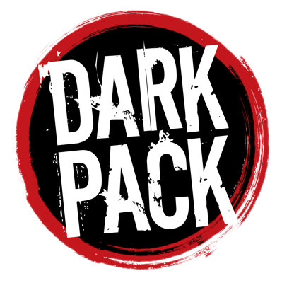

# BeyondElysium

Character management for Mind's Eye Theatre LARP, built as a WordPress plugin for [One World by Night](https://www.owbn.net/).

**`v1.3.8.1` — released and running in production chronicles.**

## What It Does

BeyondElysium runs character sheets, player submissions, and Storyteller approval for a LARP chronicle. It ships complete sheets for every World of Darkness creature type — Vampire, Werewolf, Mage, Changeling, Wraith, Demon, Mummy, Kuei-Jin, Fera, Bête, Mortal — with **no creature-specific code anywhere**. A new creature type is a configuration entry, not a rewrite.

**Characters and approval**

- Full character editor with draft autosave, XP tracking, and a real submit → review → approve workflow.
- Approval rules a chronicle sets for itself, down to a single trait value, power level, or identity-field option.
- Point audit: a line-by-line account of what a sheet is worth in XP, marking honestly what can't be priced rather than guessing.
- Health levels, resource pools, blood magic paths, Elder-tier discipline pricing — the mechanics, not an approximation of them.
- A catalog for each creature type: its own Abilities, Backgrounds, Merits, Flaws and powers, with their own prices and groupings, declared in reviewable files that ship with the plugin. A new install starts on it, and a chronicle's HST can open any of those purchase lists to every creature type from Chronicle Setup, one area at a time, and a Grapevine import matches against them too.
- Homebrew that isn't in the catalog waits for a Storyteller to set its price at approval. Nothing custom is approved for free.

**Grapevine interoperability**

- Reads and writes Grapevine 3.01's own exchange format (`.gex`, binary and XML, all twelve character classes) and full game files (`.gv3`).
- Import with duplicate detection and a review wizard for anything matching can't resolve on its own.
- Chronicle-to-chronicle character transfer, online or by file, with a travelling/visiting badge on both ends.
- Players can send their own exported sheet straight to a chronicle — joining it, or visiting for a game — for a Storyteller to review and accept.

**Signed, verifiable documents**

- Character sheets print as cryptographically signed PDFs, not browser output.
- Every export and transfer can carry a verification code, checkable by anyone at a public endpoint — confirming the document is genuine and whether it still matches the character today.

**Running a chronicle**

- Storyteller Toolkit for plots, downtime actions, and rumors — written by hand or generated from chronicle data.
- Query engine across characters, items, locations, and rotes, with bulk XP, status, and pool operations straight off a result set.
- Twenty reports — rosters, sign-in sheets, item/location/rote cards, statistics, House Rules — all as signed PDFs.
- Items, locations, rotes, and a full Harpy boon ledger.
- One setup checklist for standing a chronicle up, computed live: every row goes green as it is done, and settings open right under their row.

**Everywhere else**

- Mobile-first sheet and editor: real touch targets, tables that become cards, no sideways scrolling.
- Catalog term translation, managed in-app by a native speaker — search a term, fix it, and it's
  right on every sheet, chronicle fork, and signed PDF immediately. Portuguese (Brazil) ships
  today; a second language costs a row, not a rebuild.
- Per-chronicle roles, standalone or integrated with a wider role system.
- A Storyteller-only writing-assist button on long-form text fields, using an API key an administrator supplies — never a default generator, never shown to a player.

## Installation

Download `beyond-elysium-1.3.8.1.zip` from [Releases](https://github.com/One-World-By-Night/BeyondElysium/releases) and install it through **Plugins → Add New → Upload Plugin**.

That zip is the built, ready-to-run plugin. The `beyond-elysium/` folder here is its *source* — `build/` and `vendor/` are generated rather than committed, so copying that folder into `wp-content/plugins/` will not work. To build it yourself:

```bash
composer install
npm install && npm run build
./bin/dist          # writes dist/beyond-elysium-<version>.zip
./bin/verify        # lint, static analysis, and the test suite
```

An install from before 1.3.4 shared one Abilities, Merits and Flaws list across every creature type. The upgrade moves it onto each creature type's own lists by itself and never touches XP; see [Moving an Older Site to the Per-Creature Lists](Documents/admin-guide.md#moving-an-older-site-to-the-per-creature-lists).

Requires PHP 8.2, WordPress 6.0 or newer, and [Elementor](https://wordpress.org/plugins/elementor/). On WordPress 6.5+ the dependency is declared in the plugin header, so WordPress offers to install Elementor for you and won't activate this plugin without it. Tested against PHP 8.2.33, MySQL 8.4.6, and WordPress 7.1.

## How It Works

Sheets are assembled from reusable building blocks — trait lists, tiered powers, resource pools, identity fields. Schema blocks define what a block holds; creature stacks assemble blocks into a full sheet; a character is an instance of a stack. Adding a creature type means configuring blocks in the admin UI, not writing code.

A chronicle can fork any block for itself without touching the shared catalog, so one chronicle's house rules never leak into another's.

## Permissions

BeyondElysium runs on plain WordPress capabilities, and integrates with [accessSchema](https://github.com/One-World-By-Night/accessSchema) for chronicle-scoped role paths where the wider OWBN stack is present. Neither depends on the other — a chronicle can run this on a bare WordPress install. If accessSchema is off, unreachable, or doesn't cover a member, permissions fall back to the plugin's own chronicle-membership table automatically.

Five roles per chronicle: **HST** and **AST** (chronicle management, characters through imports), **Narrator** (plots, actions, rumors, and the roster queries behind them), **Boons** (the Harpy's ledger), and **Player** (their own characters and changes, nothing else). Full breakdown in the [Storyteller Guide](Documents/st-guide.md#roles-reference).

## Documentation

The plugin ships its own in-app documentation — four guides and a per-screen help panel on every screen. The same guides, unedited, are mirrored here:

- [Storyteller Guide](Documents/st-guide.md) — running a chronicle end to end.
- [Admin Guide](Documents/admin-guide.md) — schema blocks, creature stacks, adding a creature type without code.
- [Player Guide](Documents/player-guide.md) — creating and editing a character, submitting changes, experience, plots.
- [REST API Reference](Documents/rest-api.md) — every route, its capability, and what it does.

The page behind every in-app Help button is in [Documents/help](Documents/help/) as well.

## Dark Pack



BeyondElysium is a non-commercial community project, not official World of Darkness material.

Portions of the materials are the copyrights and trademarks of Paradox Interactive AB, and are used with permission. All rights reserved. For more information please visit worldofdarkness.com.

## License

GPL-2.0-or-later
